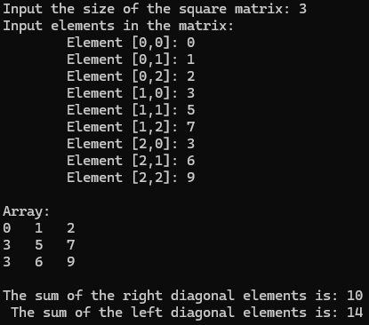

Write a C# Sharp program to find the sum of the right diagonals of a matrix.

(Right diagonal is from top-right corner to bottom-left corner)

---
### Test Data :
        Input the size of the square matrix: 2
        Input elements in the first matrix:
            element - [0],[0] : 1
            element - [0],[1] : 2
            element - [1],[0] : 3
            element - [1],[1] : 4
        Expected Output:
            The matrix is:
                1 2
                3 4
            Addition of the right diagonal elements is: 5
---
### Code Output:

